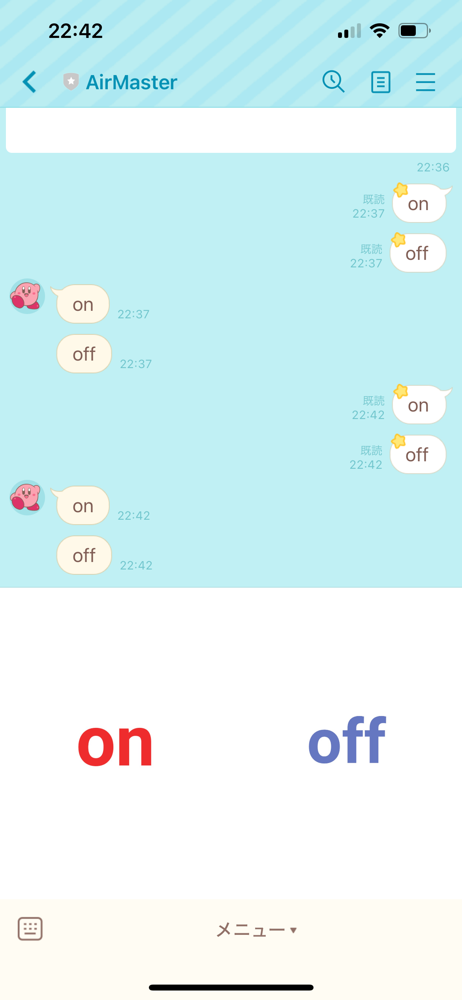

# ac_master
ベースは[これ](https://ediy-fan.com/beebotte/)を参考にしていく
あと[これ](https://note.com/khe00716/n/n8064e6484037)
## 概要

## Line Bot(りょうぴ)
- Line Botの作り方+GASとの連携
[参考](https://qiita.com/cog1t0/items/cc7779345a01192d8f01)
 - LineのUIを**on**と**off**のボタンを二つにしたい
 - UIの工夫は[ここ](https://qiita.com/cog1t0/items/cc7779345a01192d8f01)
 - リッチメニューの作成
     - UIの見た目の欄に張ってある画像のようにボタンで特定のメッセージを送れたりいろいろできる機能
     - 期限付きでしか設定できないので敵機的に期限を延ばしていく
     - LINE Dvelopmentsで作成可能
- [line devekopments](https://developers.line.biz/ja/)からアカウント作成

- botのQRコード
    - けした

- UIの見た目

- GASのコードの作成
    - Google Driveで空のスプレッドシートを作成。
    - ExtensionsからApp Scriptを選択
    - ライブラリに[line-bot-sdk](https://github.com/kobanyan/line-bot-sdk-gas)からスクリプトIDをコピーしてLineBotSDKというライブラリを追加
    - 以下のコードをコピーする

## Beebotte
- MQTTというHTTPと似てるやつでESP32と通信
- [beebote](https://beebotte.com/home)でアカウントを作る

## ESP32
- MQTT通信で送られてきたデータをsubscribeをする
- そのデータをもとに赤外線でエアコンのオン、オフ信号を送る
- 赤外線で送るデータは[ここ](https://asukiaaa.blogspot.com/2021/12/copy-and-send-ir-signal-by-esp32-arduino.html)を参考にすればいけそう

